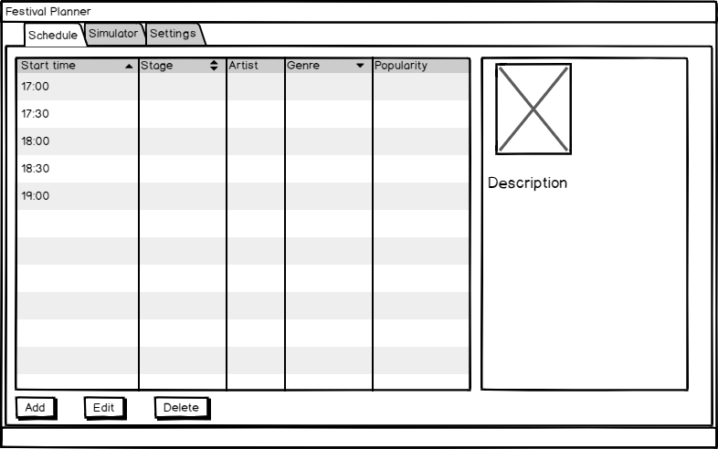
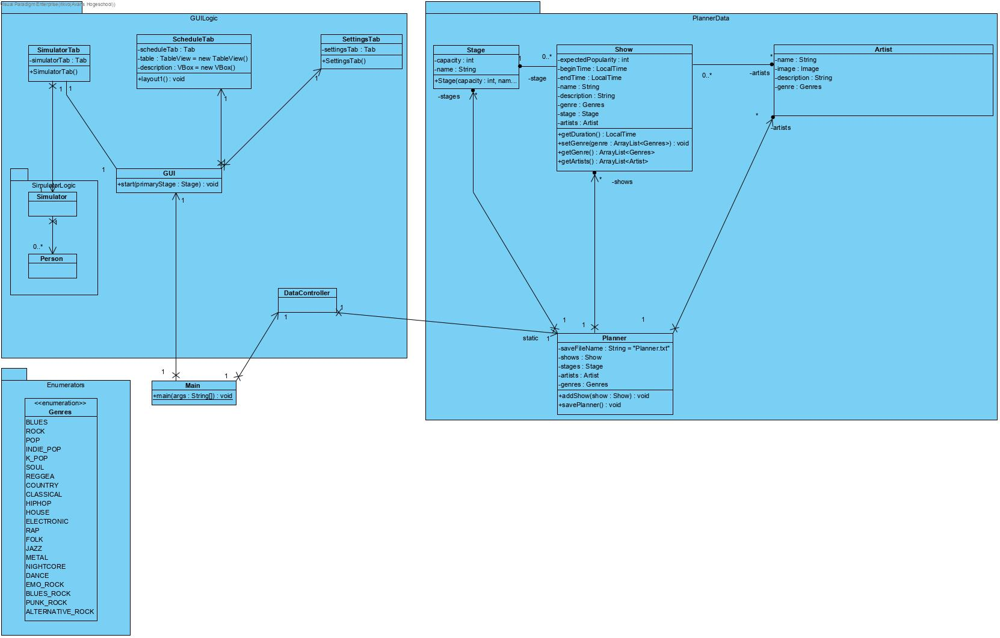
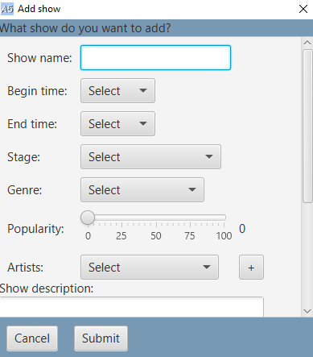
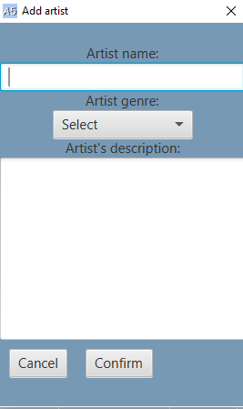
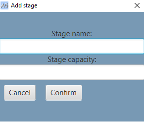
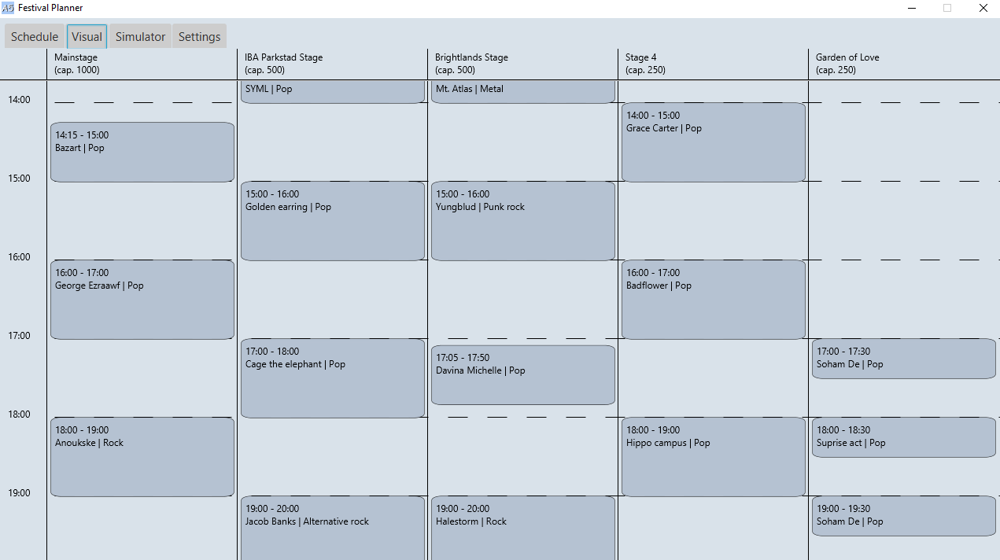
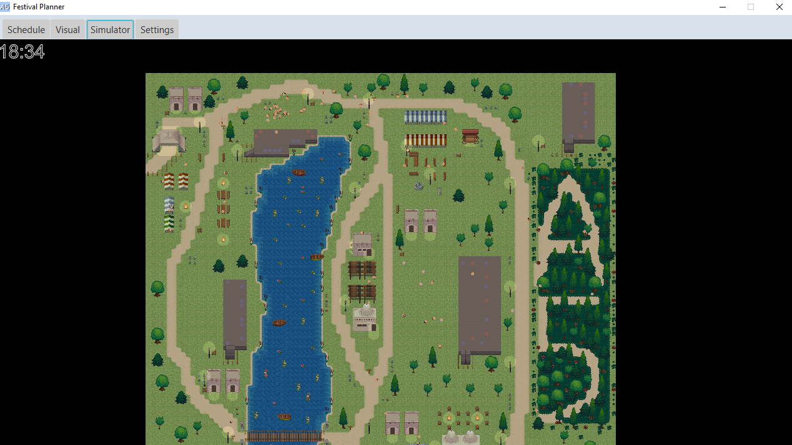

# **NPConcerts**
NPConcerts is een project dat een festival simuleert. Hierin lopen bezoekers naar shows en rustplekken. Hierin zijn de tijden, artiesten, stages en populariteit instelbaar. 

