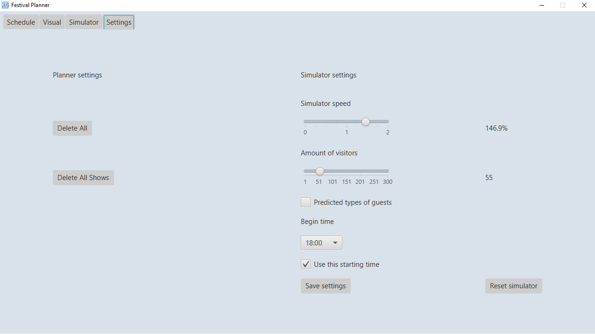

# **NPConcerts**
NPConcerts is een project dat een festival simuleert. Hierin lopen bezoekers naar shows en rustplekken. Hierin zijn de tijden, artiesten, stages en populariteit instelbaar. Dit is een project vanuit Serious Sims, een bedrijf dat simulatiesoftware bouwt voor bedrijven. Er is met 6 man 9 weken over dit project gedaan.

Dit was onze mock-up van de schedule tab. Hierin is te zien dat wij kozen voor een TableView waarbij start tijd en uiteindelijk eind tijd. Er is uiteindelijk meer bijgekomen.

De volgende afbeelding is een klassendiagram van het project, hierin is alles weergegeven behalve de simulator en NPCLogic. Dit was ons ontwerp voordat we begonnen met programmeren.

## Voorbeelden
Nu komen de voorbeelden van elke belangrijk onderdeel bij deze applicatie.

Ten eerste de ScheduleTab, deze is uiteindelijk redelijk hetzelfde gebleven in vergelijking met de mock-up, maar er zijn wat dingen bijgekomen. Zo is er een knop voor Add, Edit en Delete voor Show, Artist en Stage gekomen. en wordt er meer weergegeven in de TableView.

Hieronder is een voorbeeld weergegeven die je krijgt wanneer je Add show klikt. Je kan dan de naam van de Show aanmaken, samen met de tijden, Stage, die al aangemaakt moet zijn, Genre, Popularity, Artists en Show description. 

Vervolgens hebben we een voorbeeld voor de Add artist en Add stage pop-ups. Bij beide is de naam instelbaar. Een artist heeft een genre en description en een Stage een capacity met minimum 20 en maximum van 10.000 personen.

Vervolgens hebben we de VisualTab. Hierin wordt het concert weergegeven met op de horizontale as de Stages(max. 6) en verticaal de tijden. Elke show wordt hierin weergegeven met een kleurde vierkant. Hierin wordt nog eens de precieze tijden weergegeven, de artiest(en) en genre.

Hierna hebben we de SimulatorTab. De simulatie begint voor wat er is ingesteld is in de settings, waar we nog op terug komen. De tijd wordt links boven weergegeven en je kan in- en uitzoomen plus draggen.

Ten slot de SettingsTab waarin men alles kan verwijderen van de planner of alleen de shows. Ook is de settings voor de simulator hier aanwezig, hierbij kan men de simulator snelheid instellen, tot 200%. De bezoekers, NPC's, aangepaste begin tijd (opt-in/opt-out) en predicted type of guests. Dat laatste wil zeggen is dat de soort NPC's (te zien aan de sprites) die spawnen afhankleijk zijn van genres die de shows hebben. Vervolgens staat onderaan 2 knoppen, save settings en reset simulator. Save settings slaat de settings van de simulator op in een JSON-file en als de Use this starting time geselecteerd is, wordt de simulator ook herstart.
De knop reset simulator herstart de simulator op de laatst opgeslagen settings.

